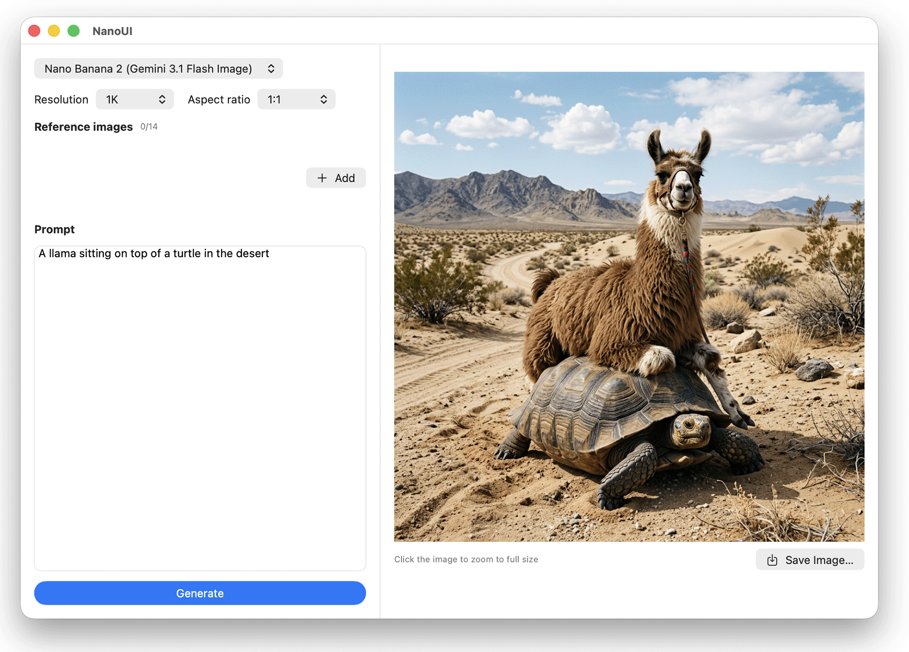

# NanoUI

A small native macOS app (Apple Silicon) for generating images with OpenRouter's
[Image API](https://openrouter.ai/docs/features/multimodal/image-generation).
Written in SwiftUI, no external dependencies.

-blue)



## Features

- **16 image models** — Nano Banana 1 / 2 / Pro / Lite, GPT Image 1 / 2,
  GPT-5 Image, GPT-5.4 Image 2, FLUX.2 Pro, Seedream 4.5, Grok Imagine 2.0,
  Qwen Image 3, Recraft V4, Riverflow V2.5 Pro, MAI Image 2.5 Pro, Krea 2 Large
- **Per-model controls** — resolution (`512`–`4K`), aspect ratio, and quality
  pickers appear only when the selected model supports them
- **Reference images** — image-to-image editing with a per-model upload cap
  (up to 14 for Nano Banana 2); thumbnails with one-click removal
- **Multi-image generation** — `n` stepper for models that support it (up to 10)
- **Zoom toggle** — results are fitted to the window by default; click an image
  to switch to 1:1 pixel zoom (scrollable), click again to fit back
- **Save as…** — per-image save panel with the correct file extension
- **API key** — read from `OPENROUTER_API_KEY`, or paste one in-app when the
  environment variable is missing (used for the session only)

## Installation

Download the latest `NanoUI-macos-arm64.zip` from
[Releases](https://github.com/DexterLagan/NanoUI/releases), unzip, and drag
`NanoUI.app` to your Applications folder.

The build is **unsigned** — on first launch, right-click the app in Finder and
choose **Open**, then confirm. Launching it from the terminal also works:

```bash
OPENROUTER_API_KEY=sk-or-... open /Applications/NanoUI.app
```

## Usage

1. Pick a model from the dropdown (defaults to **Nano Banana 2**).
2. Optionally set resolution, aspect ratio, and quality for the selected model.
3. Click **Add** to upload up to 14 reference images (the counter shows the
   model's limit).
4. Type a prompt and hit **Generate**.
5. Click the result to toggle between fit-to-window and 1:1 zoom. Use
   **Save Image…** to export.

## Building from source

Requirements: macOS 14+, Xcode Command Line Tools (`xcode-select --install`),
Apple Silicon.

```bash
# Run directly (debug build, opens a window)
swift run

# Build a double-clickable NanoUI.app (release)
./build-app.sh
```

## Parameters

The app targets the dedicated Image API (`POST /api/v1/images`). Parameters
used: `model`, `prompt`, `n`, `resolution`, `aspect_ratio`, `quality`, and
`input_references` (base64 data URLs). Per-model capabilities (allowed
resolution/aspect values, reference limits, max `n`) are hardcoded in
`Sources/NanoUI/OpenRouterService.swift` from OpenRouter's
[Image Models API](https://openrouter.ai/api/v1/images/models) discovery data.

### Supported models

| Model | Resolution | Max refs | Max n | Quality |
| --- | --- | --- | --- | --- |
| Nano Banana 2 (`google/gemini-3.1-flash-image`) | 512, 1K, 2K, 4K | 14 | 1 | — |
| Nano Banana (`google/gemini-2.5-flash-image`) | — | 3 | 1 | — |
| Nano Banana Pro (`google/gemini-3-pro-image`) | 1K, 2K, 4K | 14 | 1 | — |
| Gemini 3.1 Flash Lite Image | 1K | 14 | 1 | — |
| GPT Image 2 (`openai/gpt-image-2`) | — | 16 | 10 | auto/low/medium/high |
| GPT Image 1 | — | 16 | 10 | auto/low/medium/high |
| GPT-5 Image | — | 16 | 10 | auto/low/medium/high |
| GPT-5.4 Image 2 | — | 16 | 10 | auto/low/medium/high |
| FLUX.2 Pro | — | 8 | 1 | — |
| Seedream 4.5 | 1K, 2K, 4K | 14 | 10 | — |
| Grok Imagine 2.0 | 1K, 2K | 3 | 1 | low/medium |
| Qwen Image 3 | 1K, 2K | 4 | 6 | — |
| Recraft V4 | — | 1 | 6 | — |
| Riverflow V2.5 Pro | 1K, 2K, 4K | 10 | 1 | — |
| MAI Image 2.5 Pro | — | 1 | 1 | — |
| Krea 2 Large | 1K | 1 | 1 | — |

### Nano Banana 2 parameters

Full parameter set for the default model, per OpenRouter's discovery API:

- `resolution`: `512`, `1K`, `2K`, `4K`
- `aspect_ratio`: `1:1`, `1:4`, `1:8`, `2:3`, `3:2`, `3:4`, `4:1`, `4:3`, `4:5`, `5:4`, `8:1`, `9:16`, `16:9`, `21:9`
- `input_references`: 0–14 images
- `n`: 1
- `seed`: boolean (not exposed in the UI)

## Project layout

```
Package.swift                      Swift package definition
Sources/NanoUI/NanoUIApp.swift     App entry point
Sources/NanoUI/ContentView.swift   UI: model picker, references, prompt, results
Sources/NanoUI/OpenRouterService.swift  Image API client + model catalog
build-app.sh                       Builds the release .app bundle
```

## License

[MIT](LICENSE) © 2026 Dexter Santucci
